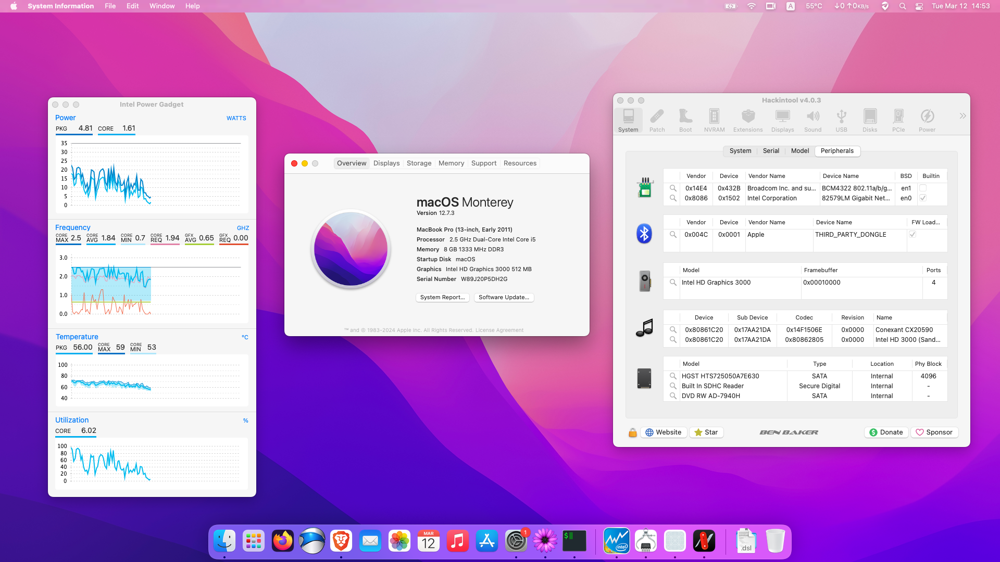
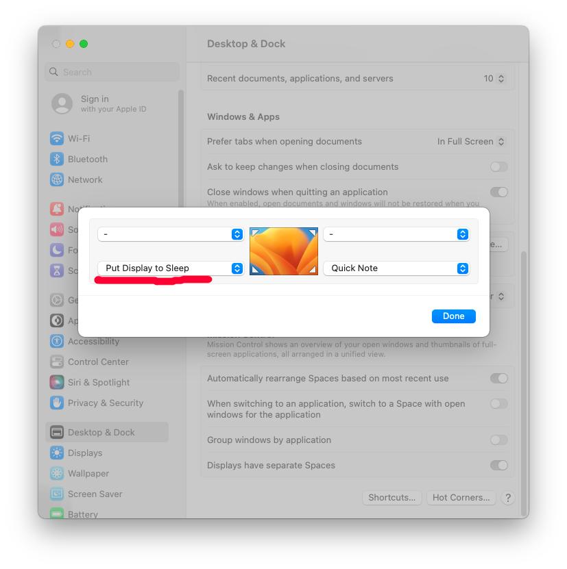

<h1 align="center">macOS Ventura on ThinkPad x220</h1>

#### I am not responsible for any damages you may cause.

> ### Non-Fuctional

| Feature                              | Status | Dependency          |
| :----------------------------------- | ------ | ------------------- |
| Fingerprint Reader                   | ❌     | `DISABLED` in BIOS to save power. |
| Wireless WAN                         | ❌     | `DISABLED` in BIOS to save power. |
| VGA Port                             | ❌     | Does not exist on real apple computers. |

> ### Video and Audio

| Feature                              | Status | Dependency          |
| :----------------------------------- | ------ | ------------------- |
| Graphics Accleration                 | ✅     | `WhateverGreen.kext`|
| Audio Recording                      | ✅     | `AppleALC.kext`     |
| Audio Playback                       | ✅     | `AppleALC.kext`     |
| Automatic Headphone Output Switching | ✅     | `AppleALC.kext`     |
| Dock Audio Port                      | ✅     | `AppleALC.kext`     |

> ### Power, Charge, Sleep and Hibernation

| Feature                              | Status | Dependency          |
| :----------------------------------- | ------ | ------------------- |
| Battery Percentage Indication        | ✅   | `ECEnabler.kext`      | 
| Power Management                     | ✅   | [`SSDT-PM.aml`](https://github.com/Piker-Alpha/ssdtPRGen.sh) |
| S3 Sleep/ Hibernation Mode 3         | ✅   |   |   
| Custom Charge Threshold              | ✅   | [YogaSMC.kext](https://github.com/zhen-zen/YogaSMC), and [YogaSMCPane](https://github.com/zhen-zen/YogaSMC) |
| Fan Control                          | ✅   | [YogaSMC.kext](https://github.com/zhen-zen/YogaSMC), and [YogaSMCPane](https://github.com/zhen-zen/YogaSMC) |
| Battery Life                         | ✅   | Native, comparable to Windows/Linux. |

> ### Input/ Output

| Feature                              | Status | Dependency          |
| :----------------------------------- | ------ | ------------------- |
| WiFi                                 | ✅     | `corecaptureElCap.kext and IO80211ElCap.kext`  |
| Bluetooth                            | ✅     | `BlueToolFixup.kext`|
| Ethernet                             | ✅     | `IntelMausi.kext`   |
| USB 2.0, 3.0(mini PCIe)              | ✅     | `USBMap.kext`       |
| USB Power Properties                 | ✅     | `SSDT-EC.aml`       |

> ### Display, TrackPad, TrackPoint, and Keyboard

| Feature                              | Status | Dependency          |
| :----------------------------------- | ------ | ------------------- |
| Brightness Adjustments               | ✅     | `WhateverGreen.kext` and `BrightnessKeys.kext`|
| TrackPoint                           | ✅     | `VoodooPS2Controller.kext` |
| TrackPad                             | ✅     | `VoodooPS2Controller.kext` |
| Built-in Keyboard                    | ✅     | `VoodooPS2Controller.kext` |
| Multimedia Keys                      | ✅     | `BrightnessKeys.kext` and [YogaSMC](https://github.com/zhen-zen/YogaSMC) |

> ### macOS Continuity

| Feature                              | Status | Dependency          |
| :----------------------------------- | ------ | ------------------- |
| iCloud, iMessage, FaceTime           | ❗     | Not tested          |
| AirDrop                              | ❗     | Not tested          |
| Time Machine                         | ❗     | Native: Not tested  |

<strong> REFERENCES </strong>

 

Read these before you start:

- [dortania's Hackintosh guides](https://github.com/dortania).
- [dortania's OpenCore Install Guide](https://dortania.github.io/OpenCore-Install-Guide/).
- [dortania's OpenCore Post Install Guide](https://dortania.github.io/OpenCore-Post-Install/).
- [dortania/ Getting Started with ACPI](https://dortania.github.io/Getting-Started-With-ACPI/).
- [dortania/ opencore `multiboot`](https://github.com/dortania/OpenCore-Multiboot).
- [dortania/ `USB map` guide](https://dortania.github.io/OpenCore-Post-Install/usb/).
- [WhateverGreen Intel HD Manual](https://github.com/acidanthera/WhateverGreen/blob/master/Manual/FAQ.IntelHD.en.md).
- [Installing macOS Ventura or newer on Sandy Bridge systems](https://github.com/5T33Z0/OC-Little-Translated/blob/main/14_OCLP_Wintel/Guides/Sandy_Bridge.md)
- [Sandy and Ivy Bridge Power Management](https://dortania.github.io/OpenCore-Post-Install/universal/pm.html#sandy-and-ivy-bridge-power-management)
- [THINKPAD X220 MACOS HIGH SIERRA 10.13 INSTALLATION GUIDE](https://x220.mcdonnelltech.com/)
- [How to Enable CPU Power Management on macOS](https://elitemacx86.com/threads/how-to-enable-cpu-power-management-on-macos-intel-amd.93/)
- `Configuration.pdf` and `Differences.pdf` in each `OpenCore` releases.

<strong> REQUIREMENTS </strong>

 

- A macOS machine(optional): to create the macOS installer.
- Flash drive, 12GB or more, for the above purpose.  
- Xcode works fine for editing plist files on macOS, but I prefer [PlistEdit Pro](https://www.fatcatsoftware.com/plisteditpro/).  
- [ProperTree](https://github.com/corpnewt/ProperTree) if you need to edit plist files on Windows.  
- [MaciASL](https://github.com/acidanthera/MaciASL), for patching ACPI tables and editing ACPI patches.
- [MountEFI](https://github.com/corpnewt/MountEFI) to quickly mount EFI partitions.  
- [IORegistryExplorer](https://developer.apple.com/downloads), for diagnosis.  
- [Hackintool](https://www.insanelymac.com/forum/topic/335018-hackintool-v286/), for diagnostic ONLY, Hackintool should not be used for patching, it is outdated.
- Patience and time, especially if this is your first time Hackintosh-ing.
- To use mod bios, download from [modified BIOS version 1.46
](https://www.mediafire.com/file/egzdbbm54a5jkqf/X220_v1.46_Modified_BIOS.zip/file).

<strong> HARDWARE </strong>

 

| Category    | THINKPAD X220            |
| ----------- | ------------------------ |
| CPU         | Intel Core i5-2520M      |
| RAM         | 8 GB DDR3                |
| HDD         | 500GB                    |
| Display     | 12.5' HD (1366x768)      |
| WiFi & BT   | BCM94322HM8L/BT Dongle   |

- Refer to [X220-Platform_Specifications](https://www.imaginesystems.net/images/datasheets/x220.pdf) for possible stock ThinkPad X220 configurations.

<strong> BIOS </strong>

   
  
| Category       |                                     |
| -------------- | ----------------------------------- |
| Version        | Modified BIOS version 1.46          |
| Serial ATA     | AHCI                                |
| VRam           | 512MB(MAX), PreDMVT=128MB(Advanced menu) |
| IO Port Access | Disabled: WiMAX, Fingerprint reader |
| Secure Boot    | Disabled                            |
| Fingerprint    | Predesktop Authentication: Disabled |
| Boot           | UEFI Only                           |
| Bootloader     | OpenCore v0.9.9                     |

<strong> GETTING STARTED </strong>

 

Before you do anything, please familiarize yourself with basic Hackintosh terminologies and the basic Hackintosh process by throughly reading Dortania guides as linked in `REFERENCES`

- Creating a macOS installer: refer to [Dortania's OpenCore Install Guide](https://dortania.github.io/OpenCore-Install-Guide/installer-guide/)
- [**README-HARDWARE**](/Other/README_HARDWARE.md): Requirements before installing.
- [**README-OTHERS**](/Other/README_OTHERS.md): for post installation settings and other remarks.

<strong> POST-INSTALLATION </strong>

 

- Turn off touchpad in Bios.
- If using mod bios, disable the AppleCpuPmCfgLock Quirk.
- Change color profile to 'Display P3'

<strong> KNOWN ISSUES </strong>

 

- Glitches on HD-3000 graphics: Use clamshell mode (single display mode)
- When OS hangs where the cursor is still moving: 'System Preferences' -> 'Desktop & Docks' -> 'Hot Corners' and enable a hot corner for display sleep.

# Credits

- [Apple](https://www.apple.com) for macOS.
- [Acidanthera](https://github.com/acidanthera) for all the kexts/utilities that they made.
- [Rehabman](https://github.com/RehabMan) and [Daliansky](https://github.com/daliansky) for the patches and guides and kexts.
- [George Kushnir](https://github.com/n4ru) for modified BIOS.
- [Dortania](https://github.com/dortania) for for the OpenCore Install Guide.
- [simprecicchiani](https://github.com/simprecicchiani) for inspirational ThinkPad configurations.
- [zhen-zen](https://github.com/zhen-zen) for **YogaSMC**.
- [Theme for Opencanopy](https://github.com/82ghost82/BigSurFlat)
- [Thinpad x220 Opencore](https://github.com/faithvoid/X220-Catalina)